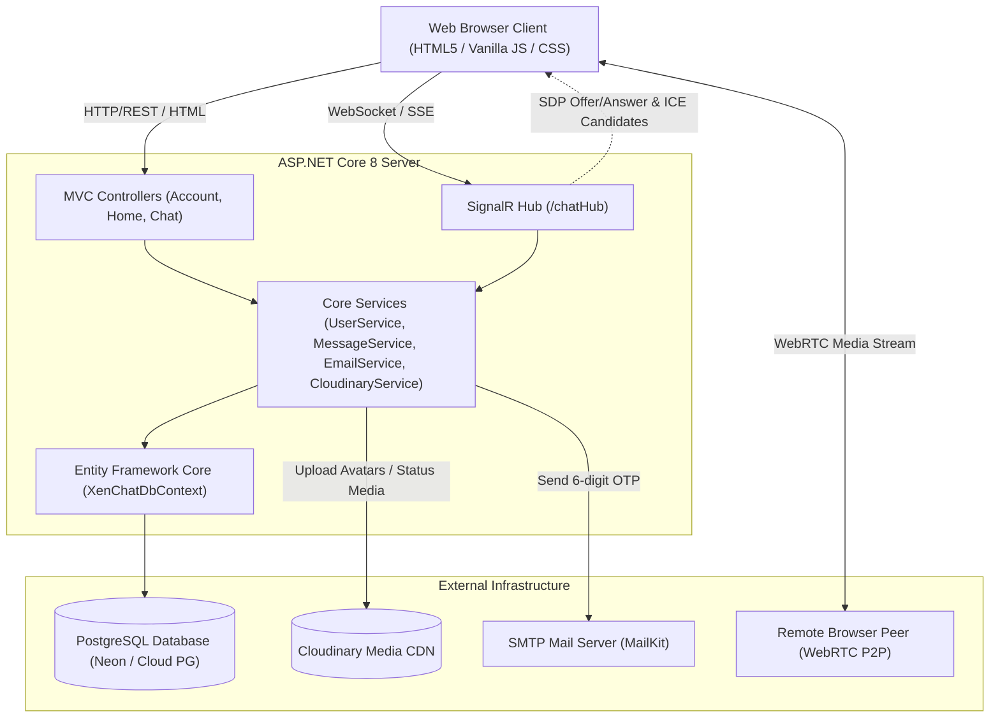

# XenChat 💬

> A modern, real-time messaging, audio/video calling, and ephemeral status-sharing web application built with **ASP.NET Core 8**, **SignalR**, **PostgreSQL**, **WebRTC**, and **Cloudinary**.

---

## 📋 Table of Contents
1. [Overview](#overview)
2. [Architecture & System Flow](#architecture--system-flow)
3. [Technology Stack](#technology-stack)
4. [Project Structure](#project-structure)
5. [Data Models & Database Schema](#data-models--database-schema)
6. [Core Features & Modules](#core-features--modules)
   - [Authentication & OTP Verification](#1-authentication--otp-verification)
   - [Real-Time Messaging](#2-real-time-messaging)
   - [WebRTC Audio & Video Calling](#3-webrtc-audio--video-calling)
   - [24-Hour Ephemeral Statuses](#4-24-hour-ephemeral-statuses)
   - [Favorites & Contact Management](#5-favorites--contact-management)
   - [User Profiles & Cloudinary CDN](#6-user-profiles--cloudinary-cdn)
7. [API & SignalR Protocol Reference](#api--signalr-protocol-reference)
8. [Configuration & Environment Variables](#configuration--environment-variables)
9. [Getting Started (Local Development)](#getting-started-local-development)
10. [Docker Containerization & Deployment](#docker-containerization--deployment)

---

## 🌟 Overview

**XenChat** is a full-featured web-based communication platform inspired by Discord and WhatsApp. It combines real-time bidirectional messaging via SignalR, peer-to-peer audio/video streaming via WebRTC, cloud media persistence via Cloudinary, and secure transactional authentication via MailKit SMTP OTP codes.

The application is structured following the **ASP.NET Core MVC (Model-View-Controller)** pattern with Razor Views, backed by **Entity Framework Core** with **PostgreSQL**.

---

## 🏛 Architecture & System Flow



---

## 🛠 Technology Stack

### Backend
- **Framework:** .NET 8.0 (C# 12) / ASP.NET Core Web MVC
- **Data Persistence:** Entity Framework Core 8.0 with `Npgsql.EntityFrameworkCore.PostgreSQL`
- **Real-Time Communication:** ASP.NET Core SignalR
- **Media Uploads:** `CloudinaryDotNet` (v1.26.2)
- **Email Delivery:** `MailKit` (v4.18.1) & `MimeKit`
- **Security & Tokens:** `System.IdentityModel.Tokens.Jwt` (v8.0.1) & `Microsoft.AspNetCore.Identity.PasswordHasher<User>`
- **Session Management:** In-memory distributed/cookie-backed session with idle timeout

### Frontend
- **Templating:** ASP.NET Core Razor Views (`.cshtml`)
- **Styling:** Custom Vanilla CSS3 (Dark UI palette `#23232a`, `#18181b`, `#ee4c49` accent), Google Font *Poppins*
- **Scripting:** Modern Vanilla JavaScript (ES6+), Fetch API, SignalR JavaScript Client (`@microsoft/signalr`)
- **Audio/Video:** Native WebRTC API (`RTCPeerConnection`, `getUserMedia`)

### Containerization & Deployment
- **Docker:** Multi-stage `Dockerfile` (SDK 8.0 build -> ASP.NET 8.0 runtime)
- **Target Ports:** Defaults to `8080` (compatible with Render, Railway, Fly.io, Azure App Services)

---

## 📁 Project Structure

```text
XenChat/
│
├── Controllers/
│   ├── AccountController.cs   # Authentication (Login, Signup, OTP Verify, Resend, Token Restore, Logout)
│   ├── HomeController.cs      # Main dashboard, chats list, 24h updates/statuses, profile, settings, favorites
│   └── ChatController.cs      # Conversation view, message sending/deletion, image uploads, favorites
│
├── Data/
│   └── XenChatDbContext.cs    # EF Core DbContext with model configurations and seed data
│
├── Hubs/
│   └── ChatHub.cs             # SignalR Hub: user presence, message broadcast, WebRTC call signaling
│
├── Models/
│   ├── User.cs                # User entity (Id, Username, Email, Password, ProfileInfo, Avatar)
│   ├── Message.cs             # Direct message entity (MessageId, SenderId, ReceiverId, Content, Timestamp, IsRead)
│   ├── Status.cs              # 24-hour ephemeral status entity (MediaUrl, Caption, CreatedAt)
│   ├── Favorite.cs            # Starred/favorited contact relations
│   ├── PendingSignup.cs       # Temporary registration state with OTP and 5-min expiration
│   └── ErrorViewModel.cs      # ASP.NET Core error view model
│
├── Services/
│   ├── UserService.cs         # User authentication, JWT generation/validation, password hashing
│   ├── MessageService.cs      # Message retrieval, conversation history, marking read, message deletion
│   ├── EmailService.cs        # MailKit SMTP client for sending 6-digit verification codes
│   ├── CloudinaryService.cs   # Cloudinary integration for uploading/deleting media
│   └── PendingSignupStore.cs  # Thread-safe in-memory cache for unverified user signups
│
├── Views/
│   ├── Account/
│   │   ├── Login.cshtml       # Login page with password visibility toggle & JWT handling
│   │   ├── Signup.cshtml      # Registration form
│   │   ├── Verify.cshtml      # 6-digit OTP verification page with resend countdown
│   │   └── AccountCreated.cshtml # Registration success screen
│   ├── Chat/
│   │   └── Index.cshtml       # Main conversation view, WebRTC calling modals, image attachment modal
│   ├── Home/
│   │   ├── Index.cshtml       # Main contacts list, search, filter tabs (Chats/Groups/Unread/Favorites)
│   │   ├── Updates.cshtml     # Statuses carousel, story viewer modal, system logs
│   │   ├── AddStatus.cshtml   # Status upload form with image preview
│   │   ├── Camera.cshtml      # Browser camera capture view
│   │   └── Profile.cshtml     # User profile editing, avatar upload, tabbed settings
│   └── Shared/
│       ├── _Layout.cshtml     # Navigation sidebar rail, responsive container, global styles
│       ├── _ValidationScriptsPartial.cshtml
│       └── Error.cshtml
│
├── wwwroot/
│   ├── css/
│   │   └── site.css           # Global design system, glassmorphism, responsive breakpoints
│   ├── images/
│   │   ├── avatars/           # Default avatar assets (caleb.png, arnold.png, user.png, etc.)
│   │   └── chat/              # Locally stored chat image attachments
│   └── js/
│       └── site.js            # Global helper scripts
│
├── .env                       # Environment configuration (DATABASE_URL, Cloudinary keys)
├── appsettings.json           # Application settings, SMTP configuration, logging levels
├── Dockerfile                 # Multi-stage production container build
├── XenChat.csproj             # .NET 8 project dependencies and metadata
└── Program.cs                 # Application bootstrap, DI configuration, database initialization
```

---

## 🗄 Data Models & Database Schema

The database automatically initializes upon application launch via raw SQL in [Program.cs](file:///c:/Users/USER/repos/gcs/XenChat/Program.cs).

### 1. `Users` Table
| Column | Type | Constraints | Description |
| :--- | :--- | :--- | :--- |
| `Id` | `SERIAL` | `PRIMARY KEY` | Unique user identifier |
| `Username` | `TEXT` | `NOT NULL` | Display username |
| `Email` | `TEXT` | `NOT NULL` | Unique email address |
| `Password` | `TEXT` | `NOT NULL` | Salted hash (PBKDF2 via `PasswordHasher<User>`) |
| `ProfileInfo` | `TEXT` | `NULL` | User biography or status note |
| `Avatar` | `TEXT` | `NULL` | Avatar filename or Cloudinary HTTPS URL |

### 2. `Messages` Table
| Column | Type | Constraints | Description |
| :--- | :--- | :--- | :--- |
| `MessageId` | `SERIAL` | `PRIMARY KEY` | Auto-incrementing message identifier |
| `SenderId` | `INTEGER` | `NOT NULL` | Foreign key referencing `Users.Id` |
| `ReceiverId` | `INTEGER` | `NOT NULL` | Foreign key referencing `Users.Id` |
| `Content` | `TEXT` | `NOT NULL` | Message text or `[img]URL[/img]Caption` syntax |
| `Timestamp` | `TIMESTAMPTZ`| `NOT NULL` | Message timestamp (UTC / local legacy) |
| `IsRead` | `BOOLEAN` | `NOT NULL DEFAULT FALSE` | Read receipt flag |

### 3. `Statuses` Table (24-Hour Stories)
| Column | Type | Constraints | Description |
| :--- | :--- | :--- | :--- |
| `Id` | `SERIAL` | `PRIMARY KEY` | Status identifier |
| `UserId` | `INTEGER` | `NOT NULL` | User who created the status |
| `Username` | `TEXT` | `NOT NULL` | Cached author name |
| `UserAvatar` | `TEXT` | `NULL` | Cached author avatar URL |
| `MediaUrl` | `TEXT` | `NOT NULL` | Cloudinary hosted image URL |
| `Caption` | `TEXT` | `NULL` | Optional text caption |
| `CreatedAt` | `TIMESTAMPTZ`| `NOT NULL` | Creation time (filtered out when > 24 hours old) |

### 4. `Favorites` Table
| Column | Type | Constraints | Description |
| :--- | :--- | :--- | :--- |
| `Id` | `SERIAL` | `PRIMARY KEY` | Favorite record identifier |
| `UserId` | `INTEGER` | `NOT NULL` | User who pinned the favorite |
| `FavoriteUserId` | `INTEGER`| `NOT NULL` | Target favorited contact |

---

## ⚡ Core Features & Modules

### 1. Authentication & OTP Verification
- **Two-Step Registration:**
  1. User fills in username, email, and password.
  2. A random 6-digit OTP is generated and stored in a thread-safe `PendingSignupStore` with a 5-minute expiration.
  3. An HTML email with the OTP is dispatched through MailKit via SMTP (`EmailService`).
  4. The user submits the code at `/Account/Verify`. Upon success, the account is committed to PostgreSQL with a securely hashed password.
- **Dual Session & JWT Auth:**
  - Standard browser navigation uses ASP.NET Core cookie sessions (`HttpContext.Session.GetInt32("UserId")`).
  - Asynchronous AJAX and SignalR requests utilize a JWT Bearer token generated upon login (`UserService.GenerateToken`).
- **Google OAuth 2.0 Authentication:**
  - One-click sign in with Google on both Login and Signup screens.
  - Automatically exchanges authorization code at `/auth/google/callback`, retrieves Google user profile (name, email, avatar), auto-provisions new users or links existing accounts, and sets up session & JWT authentication.
  - Supports Google Identity Services (One Tap) credential validation.
  - Dynamic reverse-proxy scheme detection ensuring strict compatibility with Render (`https://xenchat-i4ek.onrender.com/auth/google/callback`).

### 2. Real-Time Messaging
- **Instant Delivery:** Sent messages are persisted to the database and immediately broadcast to the recipient via `ChatHub.SendMessage`.
- **Media Messages:** Images uploaded in conversations are saved to `/wwwroot/images/chat/` and formatted as `[img]<url>[/img]<caption>`. The front-end renders these with click-to-enlarge lightbox support.
- **Message Deletion:** Senders can delete their own messages. A call to `/Chat/DeleteMessage` removes the record from the database and instructs `ChatHub.DeleteMessage` to notify both clients to remove the message DOM node dynamically.
- **Unread Counter & Read Receipts:** Opening a conversation automatically marks all unread incoming messages as `IsRead = true`.

### 3. WebRTC Audio & Video Calling
- **Direct P2P Media Streams:** Implemented natively using browser `RTCPeerConnection` and Google STUN servers (`stun:stun.l.google.com:19302`).
- **SignalR as the Signaling Server:**
  - `CallUser(callerId, targetUserId, callerName, isVideo)` -> triggers incoming call popup with audio ringtone.
  - `AnswerCall(callerId, targetUserId, accepted, isVideo)` -> establishes or declines call.
  - `SendCallOffer` & `SendCallAnswer` -> exchanges SDP session descriptions.
  - `SendIceCandidate` -> relays ICE network candidates between peers.
  - `EndCall` -> terminates media tracks and resets modal state.
- **In-Call Controls:** Real-time call duration timer, microphone mute/unmute toggle, and camera video toggle.

### 4. 24-Hour Ephemeral Statuses
- Users can post visual status updates with captions at `/Home/AddStatus`.
- Uploaded images are sent directly to Cloudinary under the `xenchat/status` folder with auto-format and auto-quality optimizations.
- The `/Home/Updates` page displays active statuses within a carousel, filtering out records older than 24 hours (`CreatedAt >= DateTime.Now.AddHours(-24)`).
- Clicking any status opens a full-screen interactive story viewer modal.

### 5. Favorites & Contact Management
- Users can star or favorite any contact from both the contacts list and chat header.
- Handled via `POST /Home/ToggleFavorite` or `POST /Chat/ToggleFavorite`.
- Filter tabs allow quick toggling between **All Chats**, **Groups**, **Unread**, and **Favorites**.
- Fast client-side contact searching with global keyboard shortcut (`⌘K` or `Ctrl+K`).

### 6. User Profiles & Cloudinary CDN
- Dedicated profile view at `/Home/Profile`.
- Allows users to update their display name, bio, and avatar.
- New avatars are validated (JPG, PNG, GIF, WebP) and uploaded to Cloudinary (`xenchat/avatars`), providing instant CDN delivery with responsive fallbacks.

---

## 📡 API & SignalR Protocol Reference

### HTTP Controller Endpoints

#### Account (`/Account` & `/auth`)
| Method | Endpoint | Description |
| :--- | :--- | :--- |
| `GET` | `/Account/Login` | Renders login page |
| `POST` | `/Account/Login` | Authenticates user credentials (supports JSON & form post) |
| `GET` | `/Account/Signup` | Renders signup page |
| `POST` | `/Account/Signup` | Submits user registration & dispatches OTP |
| `GET` | `/Account/Verify` | Renders OTP verification form |
| `POST` | `/Account/Verify` | Validates OTP & creates user record |
| `POST` | `/Account/ResendCode` | Re-generates OTP and re-sends email |
| `POST` | `/Account/RestoreSession` | Validates JWT token and reconstitutes session |
| `GET` | `/auth/google` or `/Account/GoogleLogin` | Initiates Google OAuth 2.0 authorization redirect |
| `GET`/`POST` | `/auth/google/callback` | Handles Google OAuth callback code exchange & profile sync |
| `GET` | `/Account/Logout` | Clears session and redirects to login |

#### Home (`/Home` or `/`)
| Method | Endpoint | Description |
| :--- | :--- | :--- |
| `GET` | `/Home/Index` or `/` | Main dashboard displaying contact list and last messages |
| `POST` | `/Home/ToggleFavorite` | Toggles starred status for a contact |
| `GET` | `/Home/Updates` | Displays active 24h statuses and stories carousel |
| `GET` | `/Home/AddStatus` | Form to upload a new status update |
| `POST` | `/Home/AddStatus` | Uploads media to Cloudinary and saves status |
| `GET` | `/Home/Profile` | User profile and settings management |
| `POST` | `/Home/Profile` | Updates bio, username, and avatar |

#### Chat (`/Chat`)
| Method | Endpoint | Description |
| :--- | :--- | :--- |
| `GET` | `/Chat/Index?userId={id}` | Opens conversation view with target user |
| `POST` | `/Chat/SendMessage` | Sends text message and triggers SignalR broadcast |
| `POST` | `/Chat/SendImage` | Uploads image attachment and sends formatted message |
| `POST` | `/Chat/DeleteMessage` | Deletes message if owned by requesting user |
| `POST` | `/Chat/ToggleFavorite` | Toggles favorite status for active contact |

---

### SignalR Hub (`/chatHub`)

#### Client Invocations (Client -> Server)
| Method | Arguments | Purpose |
| :--- | :--- | :--- |
| `RegisterUser` | `int userId` | Registers client connection ID with user ID; broadcasts online status |
| `GetOnlineUsers` | - | Requests list of currently active user IDs |
| `SendMessage` | `int senderId, int receiverId, string msg, string name, int msgId` | Broadcasts message to all clients |
| `DeleteMessage` | `int messageId, int senderId, int receiverId` | Broadcasts message deletion notification |
| `CallUser` | `int callerId, int targetUserId, string callerName, bool isVideo` | Initiates WebRTC call request |
| `AnswerCall` | `int callerId, int targetUserId, bool accepted, bool isVideo` | Accepts or rejects incoming call |
| `SendCallOffer` | `int senderId, int receiverId, string sdp` | Exchanges WebRTC SDP offer |
| `SendCallAnswer` | `int senderId, int receiverId, string sdp` | Exchanges WebRTC SDP answer |
| `SendIceCandidate` | `int senderId, int receiverId, string candidateJson` | Relays ICE candidates |
| `EndCall` | `int senderId, int receiverId` | Notifies remote peer to terminate call |

#### Server Events (Server -> Client)
| Event | Payload | Purpose |
| :--- | :--- | :--- |
| `UserStatusChanged` | `int userId, bool isOnline` | Updates online indicator badge |
| `OnlineUsersList` | `List<int> userIds` | Delivers initial active user list |
| `ReceiveMessage` | `senderId, receiverId, message, senderName, time, messageId` | Appends new message bubble |
| `MessageDeleted` | `messageId, senderId, receiverId` | Removes message bubble from DOM |
| `IncomingCall` | `callerId, targetUserId, callerName, isVideo` | Triggers incoming call dialog |
| `CallAnswered` | `callerId, targetUserId, accepted, isVideo` | Updates initiator call state |
| `ReceiveCallOffer` | `senderId, receiverId, sdp` | Applies remote SDP offer |
| `ReceiveCallAnswer` | `senderId, receiverId, sdp` | Applies remote SDP answer |
| `ReceiveIceCandidate`| `senderId, receiverId, candidateJson` | Adds remote ICE candidate |
| `CallEnded` | `senderId, receiverId` | Resets active call modal and media tracks |

---

## ⚙️ Configuration & Environment Variables

The application reads configuration from the environment and the local `.env` file upon startup.

### Required Environment Variables

```env
# Database Connection (Neon / PostgreSQL)
DATABASE_URL="postgresql://<user>:<password>@<host>:<port>/<database>?sslmode=require"

# Cloudinary (Image CDN for Avatars & Statuses)
Cloudinary__CloudName="your-cloud-name"
Cloudinary__ApiKey="your-api-key"
Cloudinary__ApiSecret="your-api-secret"

# Google OAuth 2.0 Credentials (Google Cloud Console)
GOOGLE_CLIENT_ID="your-google-client-id"
GOOGLE_CLIENT_SECRET="your-google-client-secret"
GOOGLE_REDIRECT_URI="https://xenchat-i4ek.onrender.com/auth/google/callback"
```

### Application Settings (`appsettings.json`)

```json
{
  "ConnectionStrings": {
    "DefaultConnection": ""
  },
  "EmailSettings": {
    "SmtpHost": "smtp.gmail.com",
    "SmtpPort": 587,
    "SenderName": "XenChat",
    "SenderEmail": "your-email@gmail.com",
    "SenderPassword": "your-app-password"
  },
  "Jwt": {
    "Key": "XenChat_Secret_Key_For_Jwt_Auth_2026_Min_32_Chars!"
  },
  "Logging": {
    "LogLevel": {
      "Default": "Information",
      "Microsoft.AspNetCore": "Warning"
    }
  },
  "AllowedHosts": "*"
}
```

---

## 🚀 Getting Started (Local Development)

### Prerequisites
- [.NET 8.0 SDK](https://dotnet.microsoft.com/download/dotnet/8.0)
- Access to a PostgreSQL instance (e.g. [Neon](https://neon.tech), Supabase, or local PostgreSQL)
- Cloudinary free account
- (Optional) Gmail app password for SMTP OTP verification

### Steps

1. **Clone the repository:**
   ```bash
   git clone <repo-url>
   cd XenChat
   ```

2. **Configure `.env` file:**
   Create or verify `.env` in the project root:
   ```env
   DATABASE_URL=postgresql://<user>:<pass>@<host>/<dbname>?sslmode=require
   Cloudinary__CloudName=your-cloud-name
   Cloudinary__ApiKey=your-api-key
   Cloudinary__ApiSecret=your-api-secret
   ```

3. **Restore and run:**
   ```bash
   dotnet restore
   dotnet run
   ```

4. **Access the application:**
   Navigate to `https://localhost:7197` or `http://localhost:5248` in your browser.

> [!NOTE]
> On the first startup, `Program.cs` automatically creates the required tables (`Users`, `Messages`, `Statuses`, `Favorites`) and seeds default test accounts (`caleb`, `arnold`, `francis`, `joana`, etc.) with default password `password123`.

---

## 🐳 Docker Containerization & Deployment

XenChat includes an optimized multi-stage `Dockerfile`:

```dockerfile
# Build stage
FROM mcr.microsoft.com/dotnet/sdk:8.0 AS build
WORKDIR /src
COPY ["XenChat.csproj", "./"]
RUN dotnet restore "XenChat.csproj"
COPY . .
RUN dotnet publish "XenChat.csproj" -c Release -o /app/publish /p:UseAppHost=false

# Runtime stage
FROM mcr.microsoft.com/dotnet/aspnet:8.0 AS runtime
WORKDIR /app
COPY --from=build /app/publish .
ENV ASPNETCORE_HTTP_PORTS=8080
EXPOSE 8080
ENTRYPOINT ["dotnet", "XenChat.dll"]
```

### Build & Run with Docker

```bash
# 1. Build the Docker image
docker build -t xenchat:latest .

# 2. Run the container locally passing environment variables
docker run -d -p 8080:8080 \
  -e DATABASE_URL="postgresql://<user>:<password>@<host>/<database>?sslmode=require" \
  -e Cloudinary__CloudName="your_cloud_name" \
  -e Cloudinary__ApiKey="your_api_key" \
  -e Cloudinary__ApiSecret="your_api_secret" \
  --name xenchat-app xenchat:latest

# 3. Visit in browser
# http://localhost:8080
```

### Deployment to Render / Railway / Cloud Services
- Set the service build command to **Docker**.
- Set the environment variables `DATABASE_URL`, `Cloudinary__CloudName`, `Cloudinary__ApiKey`, and `Cloudinary__ApiSecret` in the hosting dashboard.
- The container exposes port `8080` by default.
